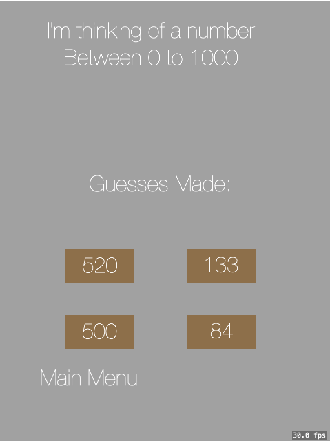
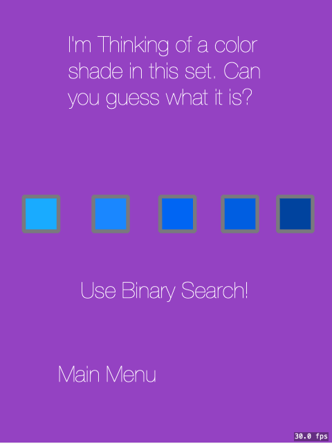
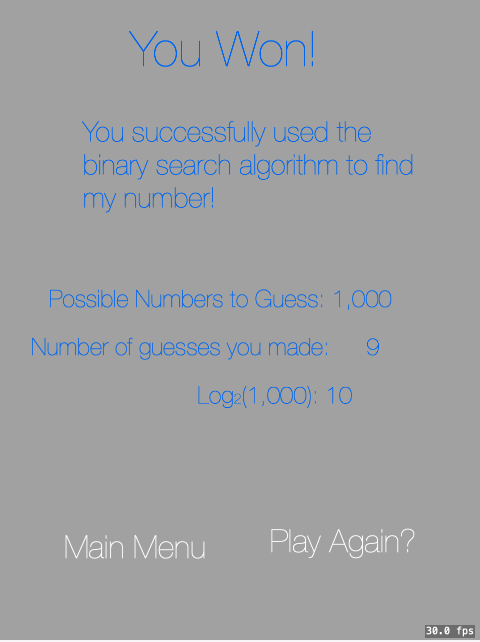
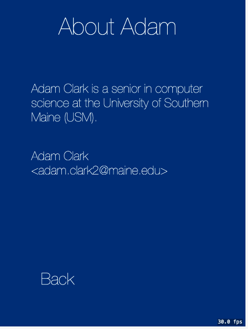

#  Binary Search
Learn how binary search works with this simple game! 

This project contains:

- An animation explaining what binary search is
- A guessing game where you guess a number between 0 - 1,000
    using binary search
- A color guessing game where you guess which color the
    computer is thinking of using binary search
- An about screen (because why not?)
 
 Thanks for taking the time to look at my project!
 
 
 Are you a developer?  
 Do you love/hate `generics`? or `function pointers`? Take a look at `ClickDetector.swift` 
 Have fun playing the game!  

# By: Adam Clark
adam.clark2@maine.edu  
  
Adam Clark is a senior in Computer Science at the University of Southern Maine. He expects to graduate in May of 2019. 

# Running
Using `XCode 10.1` double click the playgrounds file. Make sure you have the assistant editor open to the live view. The assistant editor is the two circles that look like a ven diagram

# Screenshots

